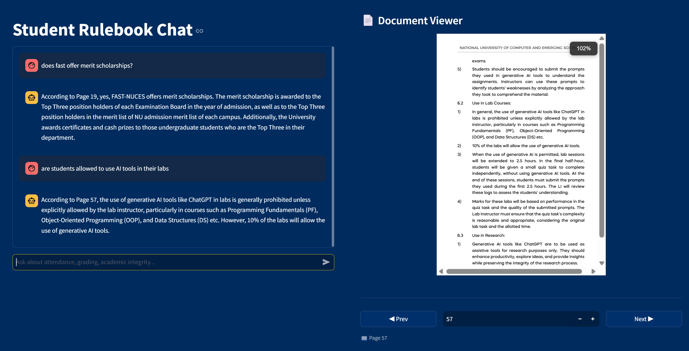

# Rulebook RAG

A RAG (Retrieval-Augmented Generation) application for querying the FAST-NUCES Student Rulebook. Ask natural language questions and get answers with page-level citations, displayed alongside a live PDF viewer.

## Requirements

- Python 3.12+
- Docker
- Groq API key

## Setup

1. **Configure environment:**

   Create a `.env` file in the project root:

   ```
   GROQ_API_KEY=your_groq_api_key
   ```

2. **Ingest the PDF:**

   ```bash
   python -m venv venv
   source venv/bin/activate
   pip install -r requirements.txt
   python cli.py
   ```

3. **Run with Docker:**

   ```bash
   docker compose up --build
   ```

   The app will be available at `http://localhost:8501`.

   **Or run locally:**

   ```bash
   docker compose up -d qdrant
   streamlit run app.py
   ```

## Demo


